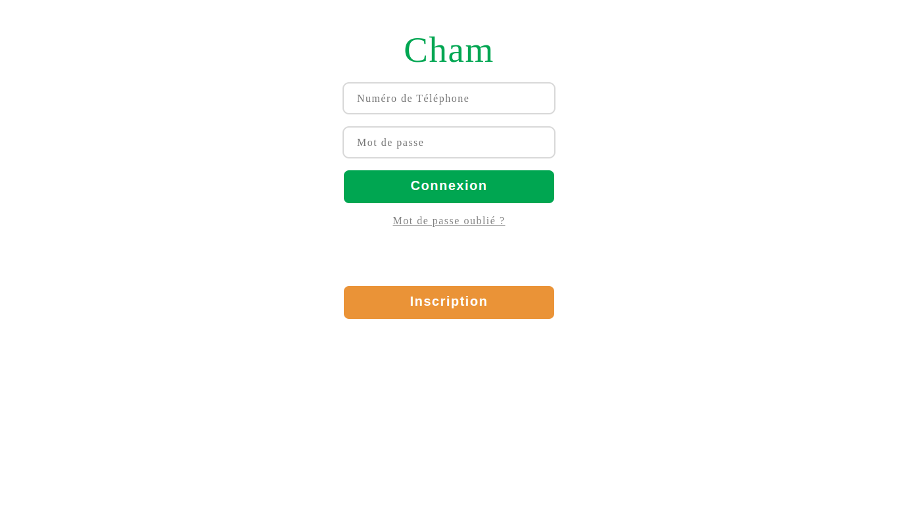
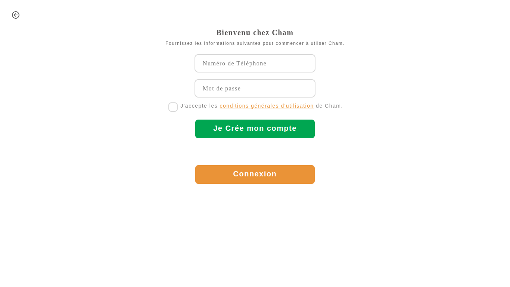
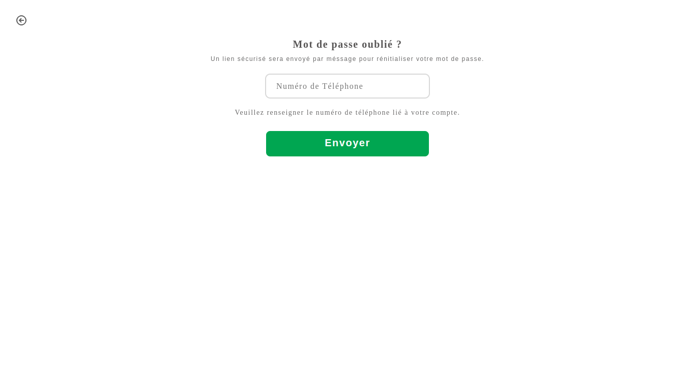
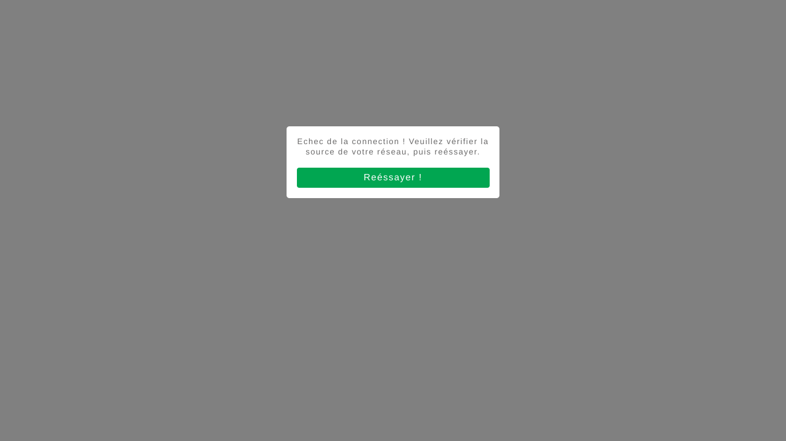

# Cham


This project is an academy project. This's made to evaluate my capacity to reproduce user interfaces with a little data; test JQuery mobile on swipe events and get more knowledge on SASS pre-processor. It's a front-end project only. No real back-end API is used. Note that the project use PHP to control which view will be displayed within certain cases. The main goal of this quiz is to train myself to build views without any CSS package like Bootstrap, etc... And explore CSS animations with JavaScript.

## Final result
This is the final result of the project:<br/><br/>







## Project installation
### <u>Install XAMPP or WAMP</u>:
- For XAMPP downloading, you can find it at this link: <a href = "https://www.apachefriends.org/fr/download.html">https://www.apachefriends.org/fr/download.html</a>
- For WAMP downloading, you can find it at this link: <a href = "https://www.wampserver.com/en">https://www.wampserver.com/en/</a>

### <u>Project cloning</u>:
```sh
git clone git@github.com:obrymec/Cham.git cham/
```

### <u>Tasks before run the project</u>:
After you clone the project, you should do the following tasks before run it:
- Move the project folder to your Wampp or Xampp server folder;
- Turn on your Wampp or Xampp server.<br/>
Now you are ready to run the project.

### <u>Run project</u>:
Open your favorite browser and tap the link below on the search bar:
- http://localhost:80/cham/main/index.php

<u><strong>Pay Attention</strong></u>: Make sure that the project folder name is: <i style = "color: skyblue;"><strong>cham</i></strong>

Enjoy :)
